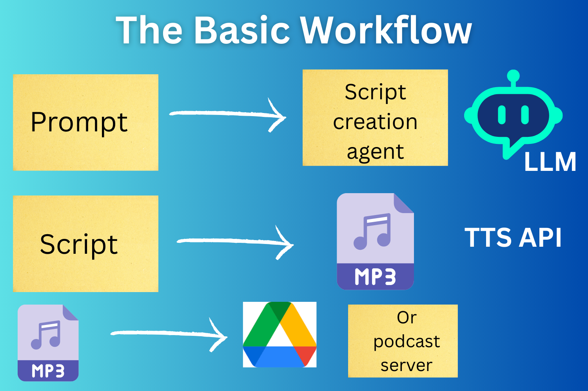

# Gemini Podcast Generator: Idea & Implementation

This AI agent (WIP) is an offshoot of an N8N workflow that I've been using for the past few weeks to generate [a podcast](https://open.spotify.com/show/4RlBls1ZQxs4ciREOR8vpU?si=34F4kvIzRVCHo5ehvNYI2w) for my own listening. It has been an enjoyable experiment!

## Table of Contents

- [Sample Episode](#sample-episode)
- [Personal AI-Generated Podcast – The Idea / Motivation](#personal-ai-generated-podcast--the-idea--motivation)
- [Key Elements: Search and a Pleasant Voice!](#key-elements-search-and-a-pleasant-voice)
- [Deployment Workflows](#deployment-workflows)
- [Getting Started](#getting-started)

## Use Case & AI Ethics Notes

The TL;DR of *"why I wanted to make this"* is that I send in AI prompts throughout the day but am often in the best frame of mind to listen to them at a later point in time (like when I'm on a walk). 

I've long been interested in finding ways to better store (and manage) AI outputs. This was an outgrowth of a previous model I built which stored outputs (and prompts) in wikis and Google Drives.

As a big believer in open source my thoughts about "when are AI podcasts okay?" goes something like this:

- It's for your own personal listening 
- It's created for that reason but is also shared publicly with the clear disclaimer that it was AI-created and no TOSes are violated in the process  

Just as I love creating AI voice agents for my own uses but think that deploying them as "customer service bots" is amoral and kind of shady, I feel the same way about this application of AI.

As much as this use-case is potentially vastly enriching, it is also rife with abuse in the form of those itnent on seeking out *really* human-like voices and deceptively passing off the generated content as human created for the purpose of turn-a-quick-dime get-rich-quick schemes. 

Then again the same can be said about almost every technology...

## Suggested Workflows For Personal Use

For those who are similarly interested in using this pattern for learning, here are some variations on the workflow that I have validated and which are appropriate:

- Save generated episodes to Google Drive and use a podcast app that pulls directly from it to listen 
- Self-host a podcast server 
- Free / publicly available podcast on third party hosting 

The "frontend" to initiate this workflow could be a webhook payload or a Google Form collector or a web UI. This worked well under all these models in N8N with the exception that the structured output parsing (as usual) was hit-and-miss which is why I created this implementation.

---

## Sample Episode

**"The Gatekeepers of Your Digital Castle: How Firewalls Filter the Web"**

This sample episode demonstrates the full capabilities of the Gemini Podcast Generator. Herman Poppleberry explains how firewalls manage network security while allowing legitimate internet traffic.

| Element | Link | Details |
|---------|------|---------|
| **Audio Episode** | [episode.mp3](generated-episodes/the-gatekeepers-of-your-digital-castle-how-firewalls-filter-the-web/episode.mp3) | **Duration:** 7m 51s |
| **Episode Script** | [script.txt](generated-episodes/the-gatekeepers-of-your-digital-castle-how-firewalls-filter-the-web/script.txt) | Full transcript with AI-generated content |
| **📋 Episode Metadata** | [metadata.json](generated-episodes/the-gatekeepers-of-your-digital-castle-how-firewalls-filter-the-web/metadata.json) | Generation details, models used, timestamps |
| **💭 Original Prompt** | [prompt.txt](generated-episodes/the-gatekeepers-of-your-digital-castle-how-firewalls-filter-the-web/prompt.txt) | User's original question about firewalls |

**Generation Details:**
- **Text Model:** gemini-2.5-flash
- **Audio Model:** gemini-2.5-pro-preview-tts  
- **Generated:** 2025-08-31T15:15:27
- **Generation Time:** ~2-3 minutes (estimated)

---

## Personal AI-Generated Podcast – The Idea / Motivation

About a year ago, I discovered the wonderful world of speech-to-text (STT) via Whisper.

Since then, I’ve been using STT to capture most of my AI prompts. (This was before the ChatGPT–Whisper integration worked reliably. Even now that it does, capturing prompts separately has the added benefit of building up your own prompt library over time.)

A workflow I’ve naturally fallen into as a result of adopting this process looks something like this:

* When I’m feeling curious, I record a few prompts — often in the middle of the workday when I don’t have time to give the generations proper attention.
* Later, when I want something interesting to listen to (at the gym, on public transit), I can play them back.

I’ve long advocated for saving AI outputs. Even if AI-generated content is, to some degree, unreliable and ephemeral, outputs (like prompts) may contain contextual data about yourself that is useful — if not now, then in a few years’ time. If outputs *are* useful, you’ll want to store them somewhere other than a vendor’s chat UI. Today, however, solutions for that are thin.

Through N8N, I began building workflows that satisfied my need for AI output storage: prompts go to an agent, outputs and prompts are saved in a database, and the content is written to a wiki. The podcast idea was a natural extension of that: why not run the outputs through a TTS API so that you can not only *read* them, but also *listen* to them if you feel inclined?

## Key Elements: Search and a Pleasant Voice!

I validated the workflow using Qwen, OpenAI, and Lemonfox. But a few things quickly became apparent:

* Unless you want to build a lot of tooling, you need an LLM with a fairly recent knowledge cutoff or strong search capabilities.
* You need a TTS voice that isn’t painful to listen to — ideally, one that’s actually enjoyable.
* If, like me, you may send dozens of prompts to AI on a busy day, you also need a model that can generate completions without bankrupting you.

11Labs has the best voices but is prohibitively expensive. Qwen lagged on knowledge freshness. OpenAI has affordable endpoints (like GPT-4o-mini and GPT-3.5 variants) but the voices aren’t great.

Turning to Google, however, I found an option that ticked all the boxes while keeping the workflow inside one ecosystem:

* Gemini models are relatively up to date, affordable, and benefit from Google’s strategic advantage as the western world’s long-dominant search engine.
* Gemini recently rolled out a very interesting [TTS layer](https://ai.google.dev/gemini-api/docs/speech-generation) that goes beyond “classic” TTS: you can prompt not only the text to be read but also stylistic instructions.

This engineering makes Gemini quite an ideal platform for podcast generation. Instead of forcing lengthy instructions into the LLM (for example: *"the text you generate must be readable by a TTS tool; therefore, don't read out full hyperlinks"*), you can move these rules to the TTS stage — or use both, with the latter functioning as a safety mechanism.

---

## The Building Blocks

The building blocks of the scripts are:

- Process 1: AI agent generating a TTS-safe narrative from the user prompt. If you're using ElevenLabs you could edit this propmt to specifically instruct it to respond in speech markup language and add appropriate emphasis and tone parameters  
- Process 2: TTS. There is a vast array of options here. I've used Speechify, LemonFox, among others. The pifall you will run into is the length limit for the mp3 that can be generated and the fact that some APIs will return your audio in raw binary 

If cost minimisation is a concern this could be adapted for local inference or you could run my original pattern: OpenAI 4.1 Mini + 4.1 Transcribe Mini. 

## System Prompt

- See: [system-prompt.md](script-elements/text-generation/system-prompt.md)

Getting the system prompt right is, in my opinion, often the most challenging but also rewarding aspect of building out AI agents and workflows. 

The system prompt included in this repo as a model is a few iterations into my experimentation.

I use "Herman Poppleberry" as a persona for my AI agents (the real Herman is a stuffed animal donkey - as is Corn the sloth!). While I included this in the system prompt to add a touch of randomness and color to the episodes, I quickly saw the pitfall - the AI will include this is *every single intro** which becomes annoying after a while. 

If you don't want your stuffed animals referenced in your personal AI podcast, omit this. The "offbeat humor" direction is there for the same reason - so that the episodes will have a touch of life to them. 

Finally, a huge advantage of Gemini's new TTS API (new at the time of writing) is the ability to add stylistic prompts in addition to text to be synthesised. This provides another area where you can add a light touch of instructions to get you away from the mechanical bot experience that might be factually interesting but is painful to listen to. 

I have experimented with this instruction but if you want something fairly neutral but apt you can instruct the model to read this text "in the style of an engaging and easy to listen to podcast host."

